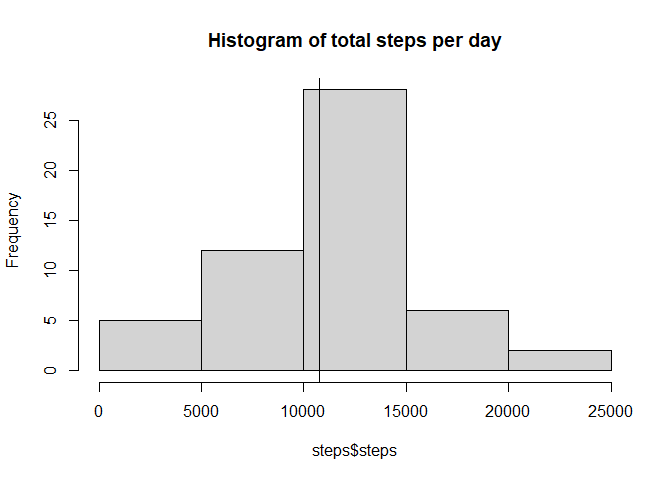
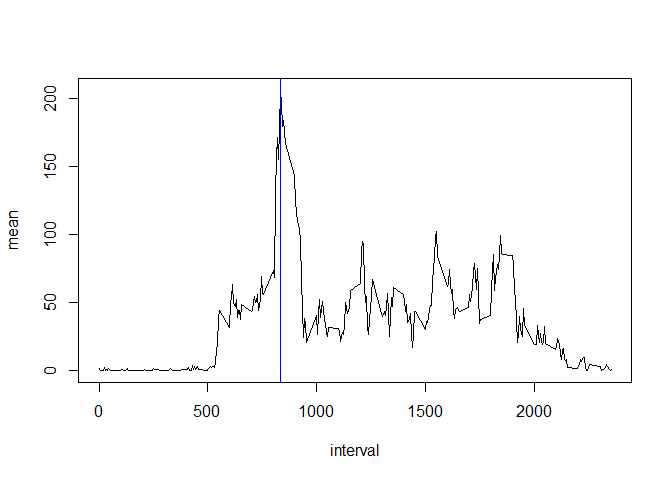
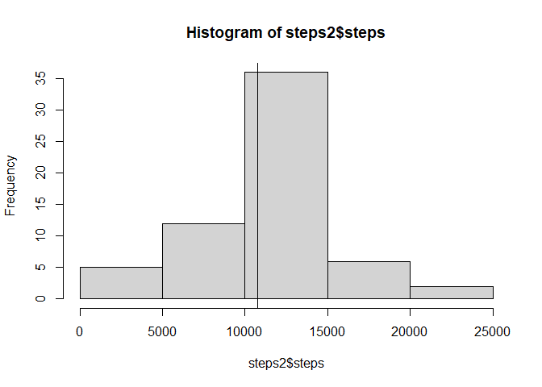
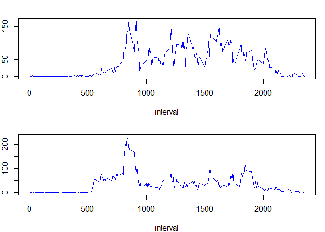

## Loading and Processing the data

From the dataset [Activity monitoring data](https://d396qusza40orc.cloudfront.net/repdata%2Fdata%2Factivity.zip) I unzipped, loaded and processed the file as below. I omitted missing values and was ready to answer the questions.


```r
library(dplyr)
```

```
## 
## Attaching package: 'dplyr'
```

```
## The following objects are masked from 'package:stats':
## 
##     filter, lag
```

```
## The following objects are masked from 'package:base':
## 
##     intersect, setdiff, setequal, union
```

```r
dat<-read.csv("activity.csv", na.strings = "NA")
dat$date<-as.Date(dat$date)
data<-na.omit(dat)
```

### 1. What is mean total number of steps taken per day?

I decided to use the base plotting system for this and subsequent questions. First I had to calculate the steps per day.


```r
steps<- data %>% group_by(date) %>% summarise(steps = sum(steps))
```

```
## `summarise()` ungrouping output (override with `.groups` argument)
```

```r
hist(steps$steps, main = "Histogram of total steps per day")
m1<- round(mean(steps$steps),digits=1); m2 <- median(steps$steps)
abline(v=c(m1,m2))
```

<!-- -->

The mean was 1.07662\times 10^{4} and the median was 10765.

### 2. What is the average daily activity pattern?


```r
avg <- data %>% group_by(interval) %>% summarise(mean=mean(steps))
```

```
## `summarise()` ungrouping output (override with `.groups` argument)
```

```r
with(avg,plot(interval,mean, type="l"))
max<-avg[which.max(avg$mean),1]
abline(v=max, col="blue")
```

<!-- -->

```r
max2<-max+5
```

The 835-840 interval, on average across all the days in the dataset, contains the maximum number of steps.

### 3. Imputing missing values


```r
c<- sum(is.na(dat$steps))
c1<-mean(is.na(dat$steps))
```

The number of missing values were 2304, a proportion of 0.1311475 from the total rows of the original dataset. To fill that information, I decided to take the average steps for that specific interval.


```r
for(i in 1:length(dat$steps)){
      if(is.na(dat[i,1])){
            dat[i,1]<- filter(avg, interval==dat[i,3])$mean
      }
}
steps2<- dat %>% group_by(date) %>% summarise(steps = sum(steps))
```

```
## `summarise()` ungrouping output (override with `.groups` argument)
```

```r
m3<- round(mean(steps2$steps), digits = 1); m4 <- round(median(steps2$steps), digits = 1)
hist(steps2$steps)
abline(v=c(m3,m4))
```

<!-- -->

```r
m5<-abs(m3-m1); m6<- round(abs(m4-m2))
```

The mean was 1.07662\times 10^{4} and the median was 1.07662\times 10^{4}. The difference with the original values is respectively 0 and 1.

### 4. Are there differences in activity patterns between weekdays and weekends?


```r
weekdays <- c('lunes', 'martes', 'miércoles', 'jueves', 'viernes')
dat$date <- if_else(weekdays(dat$date) %in% weekdays, 'weekday','weekend')
dat$date <- as.factor(dat$date)
avg2 <- dat %>% group_by(date,interval) %>% summarise(mean=mean(steps, na.rm = T))
```

```
## `summarise()` regrouping output by 'date' (override with `.groups` argument)
```

```r
par(mfcol=c(2,1), mar=c(4,2,2,1))
with(filter(avg2, date=="weekend"), plot(interval,mean,type="l", col="blue", 
                                         ylab="average steps in weekends"))
with(filter(avg2, date=="weekday"), plot(interval,mean,type="l", col="blue",
                                         ylab="average steps in weekdays"))
```

<!-- -->

